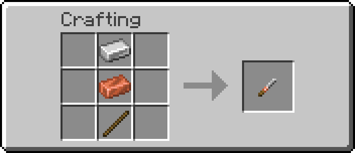
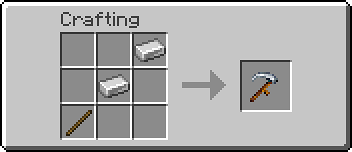
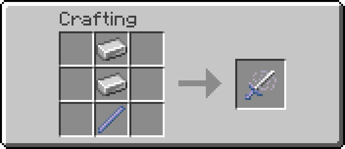
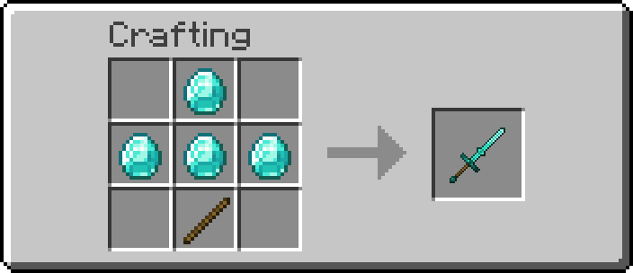
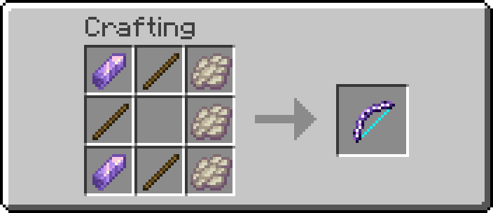
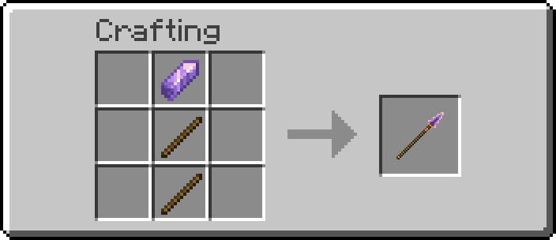
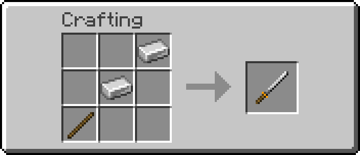
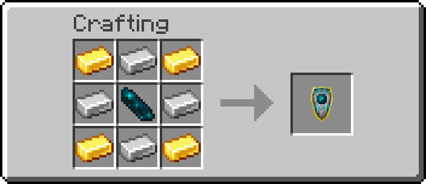

# Pepe's Forge Items

Detailed item and recipe reference for the current Pepe's Forge item set.

## Table of Contents
- [Chisel](#-chisel)
- [Scythe](#-scythe)
- [Wind Blade](#️-wind-blade)
- [Greatsword](#️-greatsword)
- [Crescent Bow](#-crescent-bow)
- [Crescent Spear](#-crescent-spear)
- [Katana](#️-katana)
- [Solar Shield](#️-solar-shield)
- [Crimson Sword](#-crimson-sword)
- [Anchor](#-anchor)
- [Throwing Knife](#-throwing-knife)
- [Give Names](#give-names)


## 🪚 Chisel

Decorative utility tool for cycling supported block variants.

| Feature | Details |
|---------|---------|
| Use | Right-click a supported block to advance one decorative variant |
| Reverse | Sneak + right-click to cycle backward |

**Crafting** (Shaped Recipe):



## 🌾 Scythe

Farming tool for harvesting ripe crops and replanting them automatically.

| Tier | Harvest Area | Effect |
|------|--------------|--------|
| **Iron Scythe** | 1×1 | Harvests ripe crops, replants from drops |
| **Diamond Scythe** | 3×3 | Harvests ripe crops, replants from drops |
| **Netherite Scythe** | 5×5 | Harvests ripe crops, replants from drops |

**Supported Crops**:
- Wheat
- Carrots
- Potatoes
- Beetroots
- Nether Wart

Replant order: Uses harvested seeds first, then inventory fallback.

**Crafting** (Shaped Recipe):



Netherite upgrade uses Smithing Table with Diamond Greatsword + Netherite Ingot.

## ⚔️ Wind Blade

Elemental melee weapons with speed effects.

| Tier | Attack Damage | Effect |
|------|---------------|--------|
| **Iron Wind Blade** | 5 | Speed I for 2s on hit |
| **Diamond Wind Blade** | 6 | Speed I while holding |
| **Netherite Wind Blade** | 7 | Speed I while holding + Speed II for 3s on hit |

| Feature | Details |
|---------|---------|
| Dash | Right-click to activate a dash ability (5-second cooldown). Available on all tiers. |

**Crafting** (Shaped Recipe):



Netherite upgrade uses Smithing Table with Diamond Wind Blade + Netherite Ingot.

## ⚔️ Greatsword

Two-handed rhythm weapons for fixed reach, widening area cuts, and space control.

| Tier | Attack Damage | Effect |
|------|---------------|--------|
| **Iron Greatsword** | 6 | Same rhythm mechanics, lower damage |
| **Diamond Greatsword** | 7 | Same rhythm mechanics, higher damage |
| **Netherite Greatsword** | 8 | Same rhythm mechanics, highest damage |

| Feature | Details |
|---------|---------|
| Rhythm | Well-timed swings build rhythm stages |
| Sweeping Cut | Timed swings trigger a forward area attack with a wider arc at higher rhythm stages |
| Cleave | Direct hits also damage nearby targets |
| Defense | Active rhythm reduces incoming frontal damage |
| Break Penalty | Bad timing or timeout briefly applies Mining Fatigue |
| Restriction | Requires an empty off-hand for custom mechanics |

**Crafting** (Shaped Recipe):



Netherite upgrade uses Smithing Table with Diamond Greatsword + Netherite Ingot.

## 🏹 Crescent Bow

Moon-themed ranged weapon that fires a three-arrow volley.

| Feature | Details |
|---------|---------|
| Arrows | Fires 3 arrows in crescent spread (center + 2 sides) |
| Ammo | Consumes 1 arrow per volley |
| Day | Deals 1 less damage during the day |
| Moonlight | Deals 2 bonus damage at night under open sky |
| Visual | Subtly shimmers under moonlight |

**Crafting** (Shaped Recipe):



## 🔱 Crescent Spear

Moon-themed melee weapon with an armed follow-up burst.

| Feature | Details |
|---------|---------|
| Charge | Each successful hit adds 20% charge, while the meter slowly decays between attacks |
| Active | The next melee hit at full charge triggers 3 rapid follow-up attacks |
| Day | Deals 1 less damage during the day |
| Moonlight | Deals 2 bonus damage at night under open sky |
| Visual | Subtly shimmers under moonlight |

**Crafting** (Shaped Recipe):



## 🗡️ Katana

Two-handed parry weapon built around short defensive timing windows.

| Feature | Details |
|---------|---------|
| Parry | Right-click enters a brief parry stance |
| Defense | Blocks melee and reflects projectiles during the active window |
| Restriction | Requires an empty off-hand for custom mechanics |

**Crafting** (Shaped Recipe):



## ☀️ Solar Shield

A legendary sun-blessed shield that charges passively during the day.
*Ancient Cities were not always shrouded in darkness...*

| Feature | Details |
|---------|---------|
| Passive Charging | Automatically gains charges (up to 3) while held under direct sunlight. |
| Retaliation | While blocking, getting hit consumes 1 charge to ignite attackers and trigger a blinding flashbang effect for 2s. |
| Discharge | Slowly loses charges when held in darkness, and instantly resets to 0 when unequipped. |
| Rarity | Legendary |

**Crafting** (Shaped Recipe):



## 🩸 Crimson Sword

A legendary weapon that grows stronger through combat, feeding on the blood of its enemies.

| Feature | Details |
|----------|---------|
| **Acquisition** | Boss Drop / Quest Reward |
| **Experience Source** | Damage Dealt |
| **Passive Scaling** | +1% Damage per weapon level (up to +30% at level 30) |

**Progression**:

| Level | Effect |
|-------|--------|
| **5** | Lifesteal: 3% of damage dealt. |
| **10** | Crimson Aura (10s): Drains 1 HP/s from entities within 2.5 blocks. |
| **15** | Lifesteal: 6% of damage dealt. |
| **20** | Crimson Aura (20s): Drains 2 HP/s from entities within 2.5 blocks. |
| **25** | Lifesteal: 10% of damage dealt. |
| **30** | Crimson Aura (30s): Drains 3 HP/s from entities within 2.5 blocks. |

*Subjected for changes*

## ⚓ Anchor

A heavy, slow-swinging marine weapon with crowd-control capability and a grappling-hook active utility.

| Feature | Details |
|---------|---------|
| **Snare (LPM)** | Melee attacks temporarily lock the target in place and prevent jumping, wrapping their feet in a visual coral display. |
| **Hook (PPM)** | Right-click launches the anchor as a projectile. Hitting a block pulls you to it, while hitting a living entity pulls you and the target together to meet in the middle. |

**Crafting** (Shaped Recipe):
- `I` = Iron Ingot
- `B` = Iron Block
- `R` = Lead

```
[Iron Ingot] [Iron Block] [Iron Ingot]
[          ] [Iron Ingot] [          ]
[          ] [Iron Ingot] [Lead      ]
```

## 🗡️ Throwing Knife

A consumable ranged weapon that's perfect for finishing off fleeing enemies or opening a fight from a distance.

| Feature | Details |
|---|---|
| **Throwing** | Can be thrown rapidly with a short cooldown. |

**Crafting** (Shaped Recipe):
- `I` = Iron Ingot
- `S` = Stick

Result: **4x Throwing Knife**

```
[          ] [Iron Ingot]
[Stick     ] [          ]
```

## Give Names

Available internal item names for `/pepeforge give`:

- `crescent_bow`
- `crescent_spear`
- `chisel`
- `katana`
- `iron_wind_blade`
- `diamond_wind_blade`
- `netherite_wind_blade`
- `iron_greatsword`
- `diamond_greatsword`
- `netherite_greatsword`
- `iron_scythe`
- `diamond_scythe`
- `netherite_scythe`
- `crimson_sword`
- `solar_shield`
- `anchor`
- `throwing_knife`

