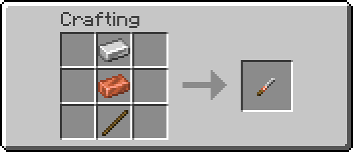
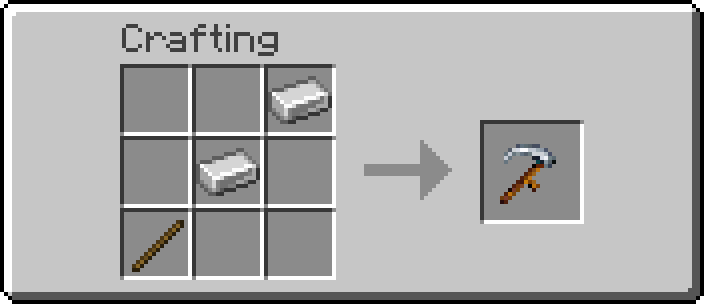
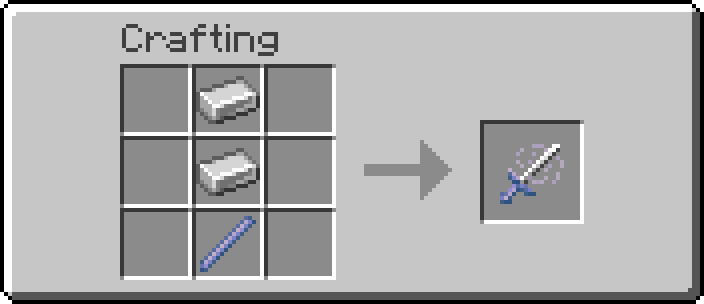
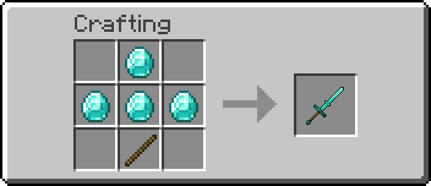
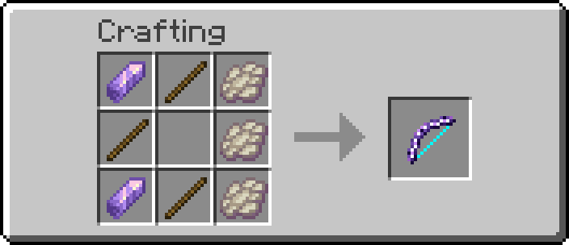
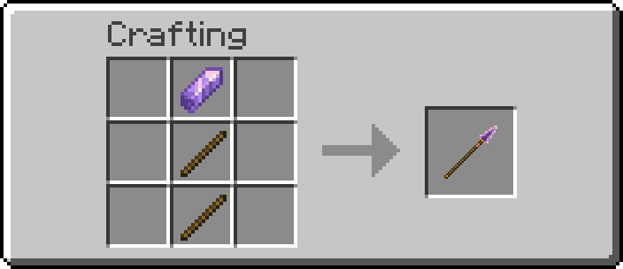
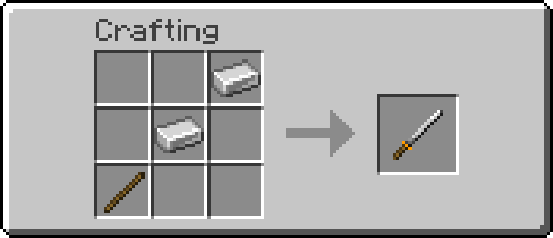
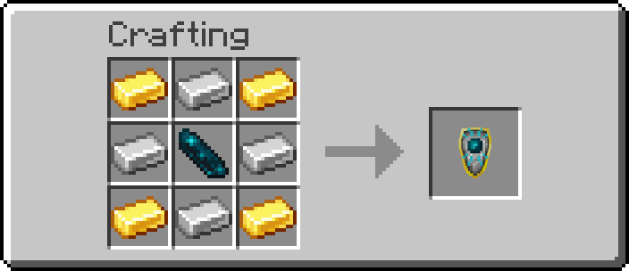
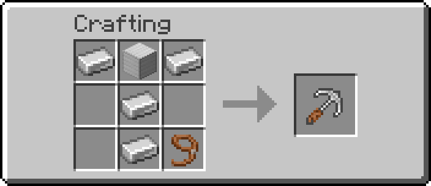
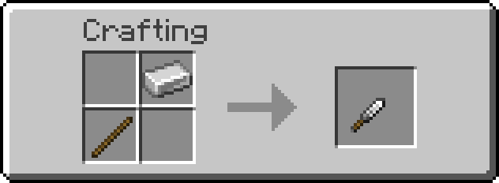

# Pepe's Forge Items

Detailed item and recipe reference for the current Pepe's Forge item set.

## Table of Contents
- [Chisel](#-chisel)
- [Scythe](#-scythe)
- [Wind Blade](#️-wind-blade)
- [Greatsword](#️-greatsword)
- [Crescent Bow](#-crescent-bow)
- [Crescent Spear](#-crescent-spear)
- [Katana](#️-katana)
- [Solar Shield](#️-solar-shield)
- [Crimson Sword](#-crimson-sword)
- [Anchor](#-anchor)
- [Throwing Knife](#-throwing-knife)
- [Stormcleaver](#-stormcleaver)
- [Emberfang](#-emberfang)
- [Give Names](#give-names)


## 🪚 Chisel

Decorative utility tool for cycling supported block variants.

| Feature | Details |
|---------|---------|
| Use | Right-click a supported block to advance one decorative variant |
| Reverse | Sneak + right-click to cycle backward |

**Crafting** (Shaped Recipe):



## 🌾 Scythe

Farming tool for harvesting ripe crops and replanting them automatically.

| Tier | Harvest Area | Effect |
|------|--------------|--------|
| **Iron Scythe** | 1×1 | Harvests ripe crops, replants from drops |
| **Diamond Scythe** | 3×3 | Harvests ripe crops, replants from drops |
| **Netherite Scythe** | 5×5 | Harvests ripe crops, replants from drops |

**Supported Crops**:
- Wheat
- Carrots
- Potatoes
- Beetroots
- Nether Wart

Replant order: Uses harvested seeds first, then inventory fallback.

**Crafting** (Shaped Recipe):



Netherite upgrade uses Smithing Table with Diamond Scythe + Netherite Ingot.

## ⚔️ Wind Blade

Elemental melee weapons with speed effects.

| Tier | Attack Damage | Effect |
|------|---------------|--------|
| **Iron Wind Blade** | 5 | Speed I for 2s on hit |
| **Diamond Wind Blade** | 6 | Speed I while holding |
| **Netherite Wind Blade** | 7 | Speed I while holding + Speed II for 3s on hit |

| Feature | Details |
|---------|---------|
| Dash | Right-click to activate a dash ability (5-second default cooldown). Available on all tiers. |

**Crafting** (Shaped Recipe):



Netherite upgrade uses Smithing Table with Diamond Wind Blade + Netherite Ingot.

## ⚔️ Greatsword

Two-handed rhythm weapons for fixed reach, widening area cuts, and space control.

| Tier | Attack Damage | Effect |
|------|---------------|--------|
| **Iron Greatsword** | 6 | Same rhythm mechanics, lower damage |
| **Diamond Greatsword** | 7 | Same rhythm mechanics, higher damage |
| **Netherite Greatsword** | 8 | Same rhythm mechanics, highest damage |

| Feature | Details |
|---------|---------|
| Rhythm | Well-timed swings build rhythm stages |
| Sweeping Cut | Timed swings trigger a forward area attack with a wider arc at higher rhythm stages |
| Cleave | Direct hits also damage nearby targets |
| Defense | Active rhythm reduces incoming frontal damage |
| Break Penalty | Bad timing or timeout briefly applies Mining Fatigue |
| Restriction | Requires an empty off-hand for custom mechanics |

**Crafting** (Shaped Recipe):



Netherite upgrade uses Smithing Table with Diamond Greatsword + Netherite Ingot.

## 🏹 Crescent Bow

Moon-themed ranged weapon that fires a three-arrow volley.

| Feature | Details |
|---------|---------|
| Arrows | Fires 3 arrows in crescent spread (center + 2 sides) |
| Ammo | Consumes 1 arrow per volley |
| Day | Deals 1 less damage during the day |
| Moonlight | Deals 2 bonus damage at night under open sky |
| Visual | Subtly shimmers under moonlight |

**Crafting** (Shaped Recipe):



## 🔱 Crescent Spear

Moon-themed melee weapon with an armed follow-up burst.

| Base Attack Damage | 5 |
| ------------------ | - |

| Feature | Details |
|---------|---------|
| Charge | Each successful attack adds at most one charge per tick. Partial charge slowly decays; full charge stays ready until used. |
| Active | The next melee hit at full charge triggers rapid follow-up attacks; the final hit lightly knocks the target back and upward |
| Day | Deals 1 less damage during the day |
| Moonlight | Deals 2 bonus damage at night under open sky |
| Visual | Subtly shimmers under moonlight |

**Crafting** (Shaped Recipe):



## 🗡️ Katana

Two-handed parry weapon built around short defensive timing windows.

| Base Attack Damage | 5 |
| ------------------ | - |

| Feature | Details |
|---------|---------|
| Parry | Right-click enters a brief parry stance |
| Defense | Blocks melee and reflects projectiles during the active window |
| Counterattack | A successful melee parry briefly damages and pushes a surviving attacker back. Counterattacks cannot chain into further counterattacks. |
| Restriction | Requires an empty off-hand for custom mechanics |

**Crafting** (Shaped Recipe):



## ☀️ Solar Shield

A legendary sun-blessed shield that charges passively in strong sky light.
*Ancient Cities were not always shrouded in darkness...*

| Feature | Details |
|---------|---------|
| Passive Charging | Charges while held in strong daylight. |
| Retaliation | While blocking, getting hit consumes 1 charge to ignite attackers and trigger a blinding flashbang effect for 2s. |
| Discharge | Loses charges in darkness, shade and while the shield is not equipped. |
| Rarity | Legendary |

**Crafting** (Shaped Recipe):



## 🩸 Crimson Sword

A legendary weapon that grows stronger through combat, feeding on the blood of its enemies.

| Base Attack Damage | 7 |
| ------------------ | - |

| Feature | Details |
|----------|---------|
| **Acquisition** | Boss Drop / Quest Reward |
| **Experience Source** | Damage Dealt |
| **Passive Scaling** | +1% Damage per weapon level (up to +30% at level 30) |

**Progression**:

| Level | Effect |
|-------|--------|
| **5** | Lifesteal: 3% of damage dealt. |
| **10** | Crimson Aura (10s): Drains 1 HP/s from entities within 2.5 blocks. |
| **15** | Lifesteal: 6% of damage dealt. |
| **20** | Crimson Aura (20s): Drains 2 HP/s from entities within 2.5 blocks. |
| **25** | Lifesteal: 10% of damage dealt. |
| **30** | Crimson Aura (30s): Drains 3 HP/s from entities within 2.5 blocks. |

*Subjected for changes*

## ⚓ Anchor

A heavy, slow-swinging marine weapon with crowd-control capability and a grappling-hook active utility.

| Base Attack Damage | 8 |
| ------------------ | - |

| Feature | Details |
|---------|---------|
| **Snare** | Melee attacks temporarily lock the target in place and prevent jumping, wrapping their feet in a visual coral display. |
| **Hook** | Right-click launches the anchor as a projectile; each player can have only one anchor in flight at a time. Hitting a block pulls you to it. Hitting a living entity damages it and can pull you and the target together. Shield blocks still allow pulling. After a hit, if the inventory cannot hold the returned anchor, it drops at the raycast impact location. Logging out during flight cancels it and returns the anchor; if the inventory cannot hold it, the anchor drops at the logout location. |

**Crafting** (Shaped Recipe):



## 🗡️ Throwing Knife

A consumable ranged weapon that's perfect for finishing off fleeing enemies or opening a fight from a distance.

| Base Attack Damage | 5 |
| ------------------ | - |

| Feature | Details |
|---|---|
| **Throwing** | Right-click to throw one knife from the stack. A short cooldown limits repeated throws. |

**Crafting** (Shaped Recipe):



## ⚡ Stormcleaver

A legendary diamond axe with an aggressive charge-and-leap combat loop.

| Base Attack Damage | 9 |
| ------------------ | - |

| Feature | Details |
|---|---|
| **Static Charge** | Each successful attack adds at most one charge per tick. Partial charge slowly decays; full charge stays ready until used. |
| **Thunder Leap** | Right-click while grounded at full charge to launch upward. Landing creates a protected knockback shockwave and cosmetic lightning strikes. A blocked ceiling triggers the impact immediately. |
| **Protection** | Shockwave damage respects region and PvP protection and never ignites blocks. |

**Crafting** (Shaped Recipe):

```text
[ Iron Block ] [ Conduit ] [ Iron Block ]
[      -     ] [  Stick  ] [      -     ]
[      -     ] [  Stick  ] [      -     ]
```

## 🔥 Emberfang

A blade of hardened magma that burns both its targets and careless wielders.

| Base Attack Damage | 7 |
| ------------------ | - |

| Feature | Details |
|---|---|
| **Ember Strike** | Strikes add the configured fire damage shown in the item's lore; target defenses can reduce it. |
| **Ignition** | Strikes have a **low chance** to briefly set the target ablaze. |
| **Self-Burn** | Burns its wielder unless they wear at least one armor piece enchanted with **Fire Protection**. |

**Crafting** (Shaped Recipe):

```text
[     -     ] [ Magma Block ] [     -     ]
[     -     ] [ Magma Block ] [     -     ]
[     -     ] [  Iron Ingot ] [     -     ]
```

## Give Names

Available internal item names for `/pepeforge give`:

```
- `crescent_bow`
- `crescent_spear`
- `chisel`
- `katana`
- `iron_wind_blade`
- `diamond_wind_blade`
- `netherite_wind_blade`
- `iron_greatsword`
- `diamond_greatsword`
- `netherite_greatsword`
- `iron_scythe`
- `diamond_scythe`
- `netherite_scythe`
- `crimson_sword`
- `solar_shield`
- `anchor`
- `throwing_knife`
- `stormcleaver`
- `emberfang`
